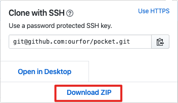
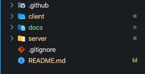
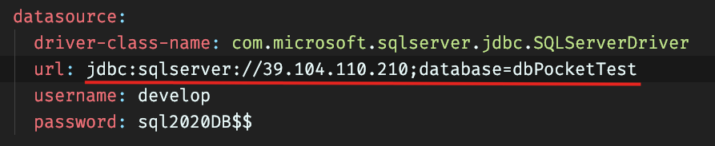
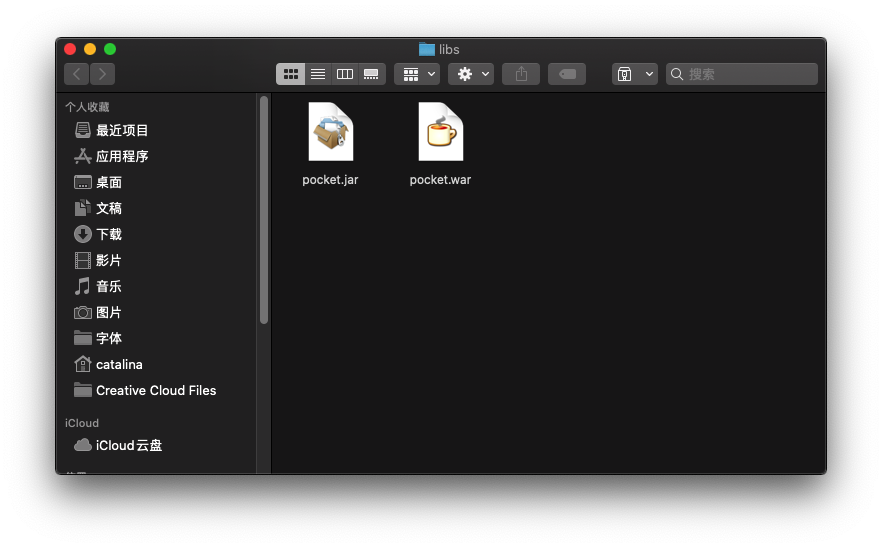
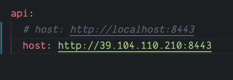
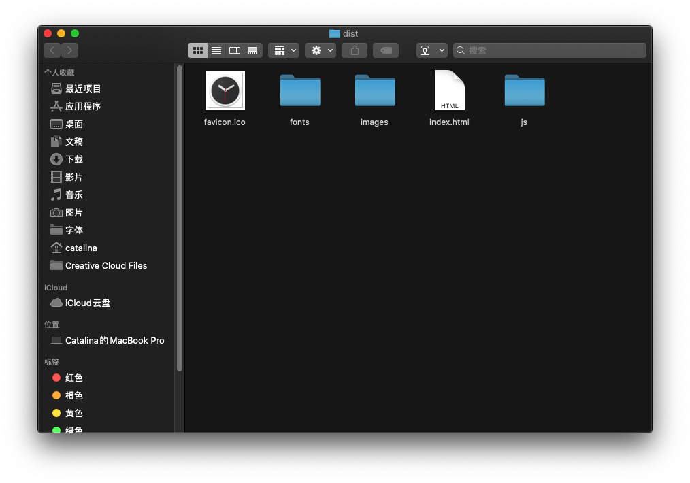

# 基于蓝牙技术的智能手机袋系统及方法

## 开发环境

- jdk版本: `1.8.0_212`, java虚拟机: `HotSpot(TM)`
- nodejs版本: `v12.12.0`
- gradle: `v6.1.1` 管理依赖、编译打包
- yarn: `1.19.1` 管理依赖, 打包
- SQL Server 2019


### 编程语言及打包构建工具

- 后端主要使用`Kotlin`语言, 运行于`JVM`平台, 使用`Gradle`管理依赖
- web前端使用`JavaScript`语言(ES6语法), 使用`Yarn`管理依赖

后端开发使用[Spring Boot](https://spring.io/projects/spring-boot)框架, 前端开发使用[React](https://reactjs.org/)框架, 使用[React Router](https://reacttraining.com/react-router)配置路由, [Redux](https://redux.js.org/)管理状态

### 开发工具

- `IntelliJ IDEA ULTIMATE Edition 2019.3.3` (JAVA 开发IDE), [下载地址](https://www.jetbrains.com/idea/)
- `Visual Studio Code 1.42.1`(文本编辑器, 用于开发web前端), [下载地址](https://code.visualstudio.com/)


### 🔜快速开始

下载[最新源码](https://github.com/ourfor/pocket)



或者使用[git](https://git-scm.com/downloads)同步源码:

```bash
git clone https://github.com/ourfor/pocket
```

安装好`jdk`、`nodejs`、`yarn `、`gradle`、`IntelliJ IDEA`、`Visual Studio Code`，项目目录结构如下:




其中`server`目录中为后端源码, 在`IntelliJ IDEA`中打开`server`目录即可, `IntelliJ IDEA`会自动发现并开始下载依赖, 依赖下载完毕后,首先配置好`src/main/resources/application.yml`)中的数据库



配置完成后, 在`src/main/kotlin/service/Main.kt`执行主方法即可启动程序


程序运行日志后保存在当前目录下面👇的`logs`文件夹中, 程序默认占用`8443`端口, `http://localhost:8443/actuator`可以查看程序运行状态, `http://localhost:8443/actuator/logfile`可以查看运行日志

- 编译打包, 命令行窗口在`server`目录下面执行`gradle clean package`后，会在`build/libs`下面生成`pocket.war`和`pocket.jar`，其中`pocket.war`可以直接部署在`tomcat`中, `pocket.jar`可以直接在存在`jre`的环境中运行



`pocket.war`直接放在`tomcet`的`webapps`目录下面即可, `pocket.jar`需要通过命令`java -jar pocket.jar`运行


---

`client`为web前端源码目录, 在`Visual Studio Code`中打开该目录, 在命令行窗口中进入到该目录下面, 执行`yarn `安装依赖, 依赖安装完毕后, 使用`yarn server`启动程序, 打开`localhost`即可,
其中`config.yml`为配置文件, 可以修改很多与业务逻辑无关的配置选项

例如，下面👇这一项就是修改后端接口的地址:




#### 打包

在`client`目录下面执行`yarn build`, 打包完毕后的产物会在`dist`目录下面



将解压到的文件放到`Apache httpd`的网站根目录即可(其他Web服务器操作相同), 构建文件默认打包路径为`/`, 如果需要部署到二级目录, 可自行修改打包

需要额外修改配置文件

> `apache httpd`

在配置文件中添加

```apache
RewriteEngine On
# If an existing asset or directory is requested go to it as it is
RewriteCond %{DOCUMENT_ROOT}%{REQUEST_URI} -f [OR]
RewriteCond %{DOCUMENT_ROOT}%{REQUEST_URI} -d
RewriteRule ^ - [L]

# If the requested resource doesn't exist, use index.html
RewriteRule ^ /index.html
```

或者将网站`404`页面指向`index.html`

> `Nginx`

```nginx
try_files $uri $uri/ /index.html;
```

> `iis`

```xml
<system.webServer>
  <rewrite>
    <rules>
      <rule name="Angular Routes" stopProcessing="true">
        <match url=".*" />
        <conditions logicalGrouping="MatchAll">
          <add input="{REQUEST_FILENAME}" matchType="IsFile" negate="true" />
          <add input="{REQUEST_FILENAME}" matchType="IsDirectory" negate="true" />
        </conditions>
        <action type="Rewrite" url="/index.html" />
      </rule>
    </rules>
  </rewrite>
</system.webServer>
```

> 相关下载: 
>
> - [Nodejs](https://nodejs.org/en/download/),  JavaScript服务端运行时
> - [jdk](https://www.oracle.com/java/technologies/javase/javase-jdk8-downloads.html)
>
> - [Gradle](https://gradle.org/releases/), 需要提前安装JDK
> - [Yarn](https://classic.yarnpkg.com/en/docs/install), 需要提前安装Nodejs

## 运行环境

- jdk版本: `8u214`, java虚拟机: `HotSpot(TM)`
- Apache httpd`2.4.41`
- SQL Server 2008

