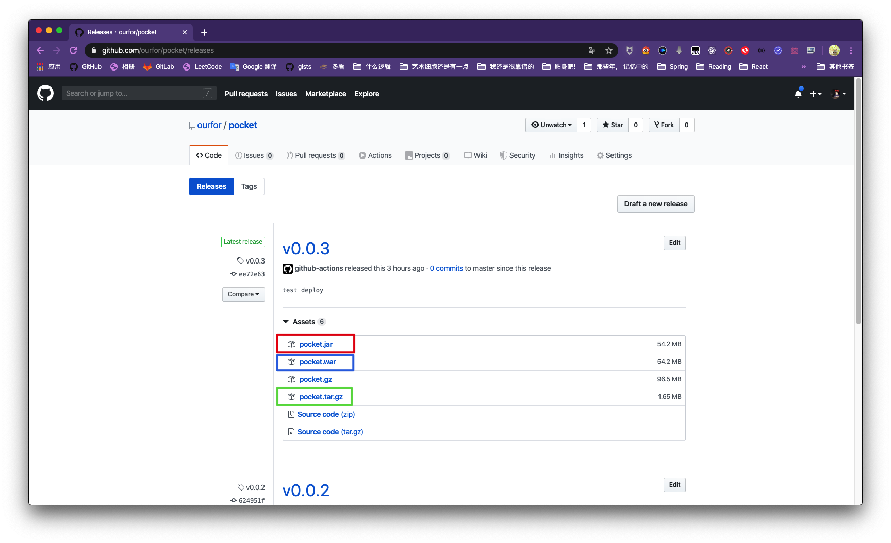
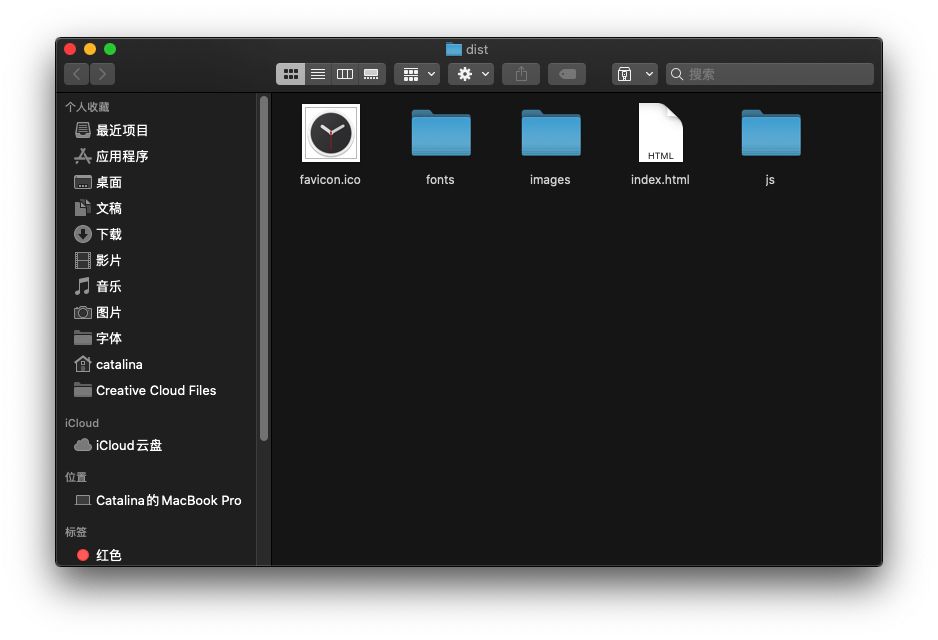

## 快速开始

项目分为前端和后端两部分, 其中`server`目录下为后端, 使用`SprintBoot`框架, 以`kotlin`为主要编程语言,
后端部署要求的环境包括:
- jdk版本`1.8`以上
- `SQL Server`数据库

下载后端构建[产物](https://github.com/ourfor/pocket/releases) `https://github.com/ourfor/pocket/releases`



可以通过两种方式部署后端:

- 通过`jar`包部署

下载构建得到的`pocket.jar`文件, 通过命令`java -jar pocket.jar`即可完成后端部署, 编译好的jar包配置的数据库地址为`localhost`, 可以通过解压软件修改`application.yml`中的数据库配置. 默认占用端口`8443`

- 通过`war`包部署

将下载得到的`war`包, 复制到Tomcat目录下面的`webapp`即可完成部署. 默认占用端口`8443`

---

Web前端部署:

下载构建产物中的`pocket.tar.gz`(默认访问后端`http://localhost:8443`), 将该压缩文件解压得到下列文件和目录:



将解压到的文件放到`Apache httpd`的网站根目录即可(其他Web服务器操作相同), 构建文件默认打包路径为`/`, 如果需要部署到二级目录, 可自行修改打包

需要额外修改配置文件

> `apache httpd`

在配置文件中添加

```apache
RewriteEngine On
# If an existing asset or directory is requested go to it as it is
RewriteCond %{DOCUMENT_ROOT}%{REQUEST_URI} -f [OR]
RewriteCond %{DOCUMENT_ROOT}%{REQUEST_URI} -d
RewriteRule ^ - [L]

# If the requested resource doesn't exist, use index.html
RewriteRule ^ /index.html
```

或者将网站`404`页面指向`index.html`

> `Nginx`

```nginx
try_files $uri $uri/ /index.html;
```

> `iis`

```xml
<system.webServer>
  <rewrite>
    <rules>
      <rule name="Angular Routes" stopProcessing="true">
        <match url=".*" />
        <conditions logicalGrouping="MatchAll">
          <add input="{REQUEST_FILENAME}" matchType="IsFile" negate="true" />
          <add input="{REQUEST_FILENAME}" matchType="IsDirectory" negate="true" />
        </conditions>
        <action type="Rewrite" url="/index.html" />
      </rule>
    </rules>
  </rewrite>
</system.webServer>
```

## 优化

在 Apache 中启用`deflate` 

```apache
<IfModule mod_deflate.c>
    AddOutputFilterByType DEFLATE text/html
    AddOutputFilterByType DEFLATE text/css
    AddOutputFilterByType DEFLATE text/javascript
    AddOutputFilterByType DEFLATE text/xml
    AddOutputFilterByType DEFLATE text/plain
    AddOutputFilterByType DEFLATE image/x-icon
    AddOutputFilterByType DEFLATE image/svg+xml
    AddOutputFilterByType DEFLATE application/rss+xml
    AddOutputFilterByType DEFLATE application/javascript
    AddOutputFilterByType DEFLATE application/x-javascript
    AddOutputFilterByType DEFLATE application/xml
    AddOutputFilterByType DEFLATE application/xhtml+xml
    AddOutputFilterByType DEFLATE application/x-font
    AddOutputFilterByType DEFLATE application/x-font-truetype
    AddOutputFilterByType DEFLATE application/x-font-ttf
    AddOutputFilterByType DEFLATE application/x-font-otf
    AddOutputFilterByType DEFLATE application/x-font-opentype
    AddOutputFilterByType DEFLATE application/vnd.ms-fontobject
    AddOutputFilterByType DEFLATE font/ttf
    AddOutputFilterByType DEFLATE font/otf
    AddOutputFilterByType DEFLATE font/opentype
    # For Olders Browsers Which Can't Handle Compression
    BrowserMatch ^Mozilla/4 gzip-only-text/html
    BrowserMatch ^Mozilla/4\.0[678] no-gzip
    BrowserMatch \bMSIE !no-gzip !gzip-only-text/html
</IfModule>
```

IIS 使用静态资源压缩

